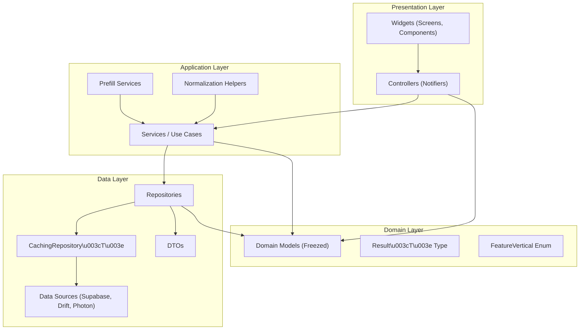
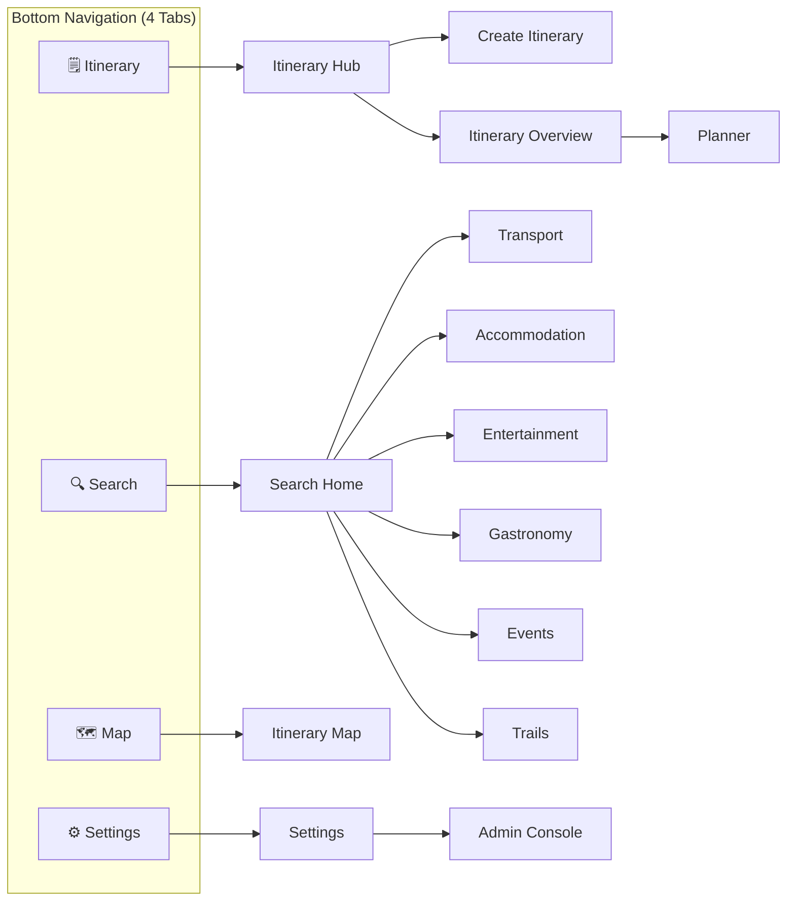
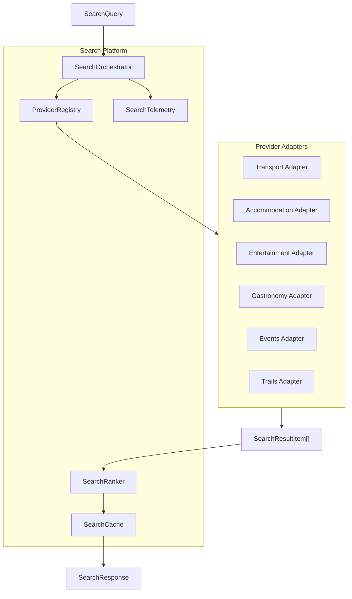
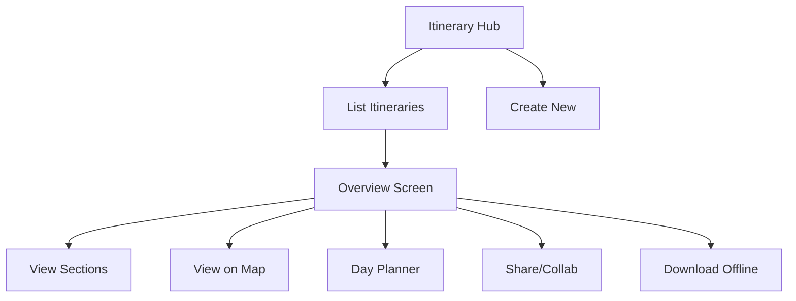
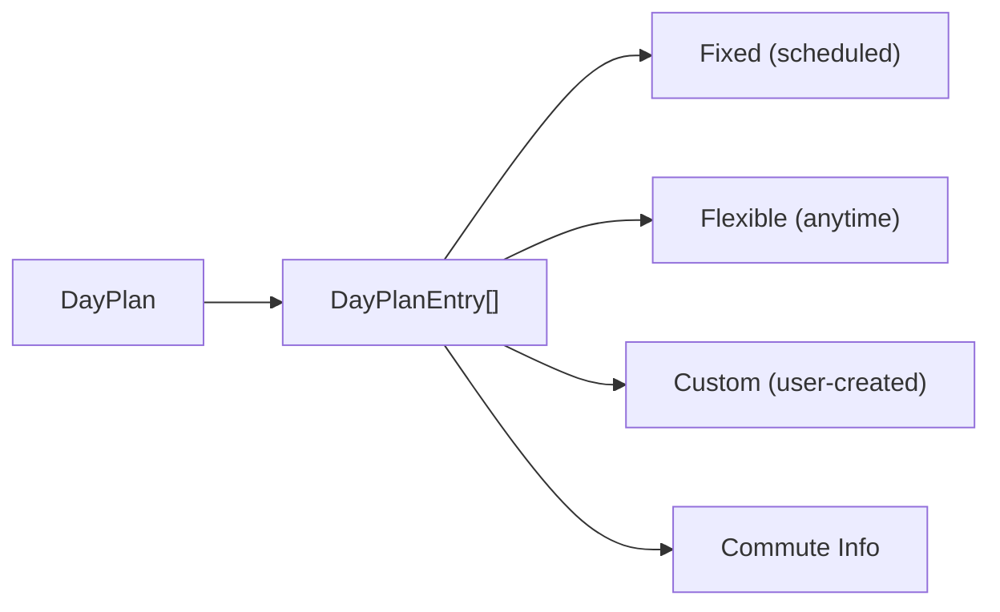
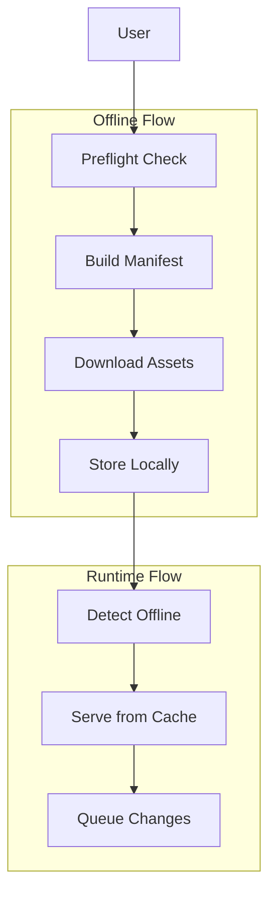
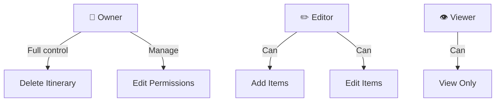
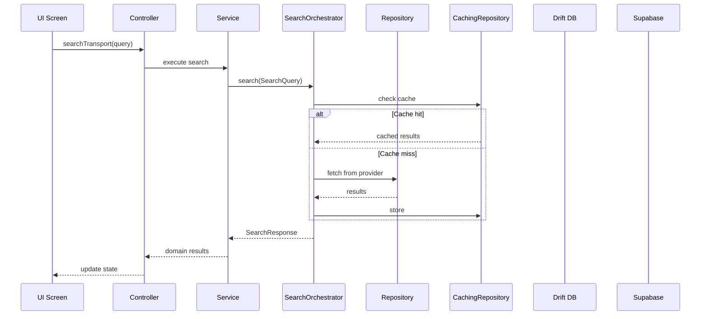
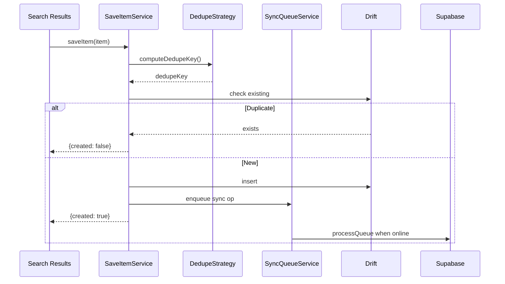
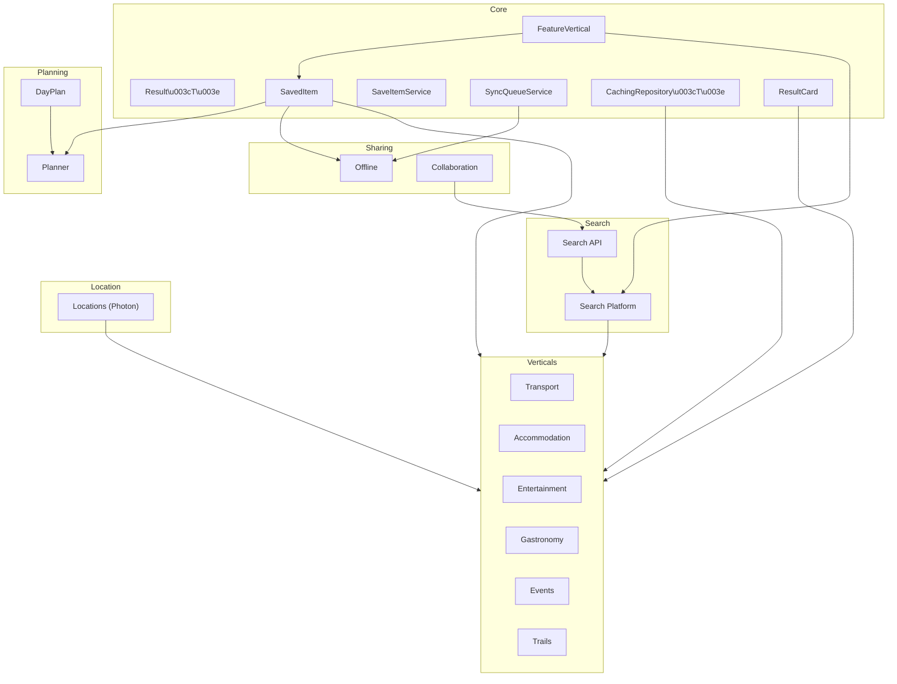

# Dastan - Itinerary Planning App Documentation

> **Last Updated:** 2026-03-05 | **Analysis Status:** Complete

## Table of Contents

1. [Project Overview](#1-project-overview)
2. [Architecture](#2-architecture)
3. [Core Module](#3-core-module)
4. [Feature Breakdown](#4-feature-breakdown)
5. [Diagrams](#5-diagrams)
6. [Implementation Strategies](#6-implementation-strategies)
7. [Testing](#7-testing)
8. [Redundancies & Improvements](#8-redundancies--improvements)
9. [Recommendations](#9-recommendations)

---

## 1. Project Overview

Dastan is a comprehensive **itinerary planning mobile app** built with Flutter. The app enables users to:

- Create and manage travel itineraries
- Search across 6 travel verticals (Transport, Accommodation, Entertainment, Gastronomy, Events, Trails)
- Save items to itineraries with automatic deduplication
- Plan daily schedules with commute calculations
- Access itineraries offline with delta sync
- Share and collaborate on itineraries with role-based permissions

### Core Concept

```
┌─────────────────────────────────────────────────────────────────┐
│                    ACTIVE ITINERARY (Required)                  │
├─────────────────────────────────────────────────────────────────┤
│  All user actions are bound to the Active Itinerary:            │
│  • Searches happen within itinerary context                     │
│  • Saved items are auto-tagged with itineraryId + section       │
│  • Offline access is per-itinerary                              │
│  • Map displays all saved items with layer toggles              │
└─────────────────────────────────────────────────────────────────┘
```

### Tech Stack

| Category | Technology |
|----------|------------|
| **Framework** | Flutter 3.x, Material 3 |
| **State** | Riverpod (code generation) |
| **Navigation** | GoRouter |
| **Backend** | Supabase (Auth, Postgres, Storage) |
| **Local DB** | Drift (SQLite) |
| **Models** | Freezed + JSON Serializable |
| **HTTP** | Dio |
| **Geocoding** | Photon API (photon.komoot.io) |
| **Connectivity** | connectivity_plus |
| **Testing** | Mocktail, Flutter Test |

---

## 2. Architecture

### 2.1 Riverpod 4-Layer Model



### 2.2 Folder Structure

```
lib/src/
├── app/                    # Router, Theme, Main Navigation (3 files)
│   ├── router.dart         # GoRouter with 4 main tabs
│   ├── router.g.dart       # Generated route code
│   └── main_navigation.dart
├── core/                   # Shared cross-feature code (53 files)
│   ├── presentation/       # Common UI components (18 files)
│   │   ├── components/     # Reusable widgets (16 files)
│   │   ├── widgets/        # Shared widget helpers (1 file)
│   │   └── save_button.dart
│   ├── application/        # Core services (8 files)
│   ├── domain/             # Core models (10 files)
│   └── data/               # Database, Supabase, providers (17 files)
└── features/               # 18 feature modules (~290 files)
    ├── accommodation/      # 27 files
    ├── admin/              # 13 files
    ├── collab/             # 14 files
    ├── entertainment/      # 14 files
    ├── events/             # 18 files
    ├── gastronomy/         # 17 files
    ├── itineraries/        # 10 files
    ├── itinerary_map/      # 12 files
    ├── locations/          # 14 files
    ├── map/                # 7 files
    ├── offline/            # 22 files
    ├── planner/            # 32 files
    ├── search/             # 2 files
    ├── search_api/         # 7 files
    ├── search_platform/    # 9 files
    ├── settings/           # 22 files
    ├── trails/             # 18 files
    └── transport/          # 26 files
```

> **Note:** Every feature module includes a `README.md` with detailed structure, models, data flows, and provider documentation.

### 2.3 Navigation Structure



---

## 3. Core Module

### 3.1 Domain Layer (`core/domain/` — 10 files)

#### FeatureVertical (Unified Enum)

The `FeatureVertical` enum consolidates the previously separate `SearchVertical` and `ItinerarySection` enums into a single source of truth:

```dart
@JsonEnum(alwaysCreate: true)
enum FeatureVertical {
  transport,
  accommodation,
  entertainment,
  gastronomy,
  events,
  trails;

  String get displayName;
  String get iconName;
}

// Backward compatibility aliases
typedef ItinerarySection = FeatureVertical;
typedef SearchVertical = FeatureVertical;
```

#### Result\<T\> (Error Handling)

A sealed class for explicit error handling, replacing ad-hoc exceptions:

```dart
sealed class Result<T> {
  Result<R> map<R>(R Function(T) transform);
  Result<R> flatMap<R>(Result<R> Function(T) transform);
  T getOrElse(T Function() orElse);
  T? getOrNull();
}

final class Success<T> extends Result<T> { final T data; }
final class Failure<T> extends Result<T> { final AppError error; }
```

**AppError Hierarchy:**

| Error Type | Purpose | Error Code |
|-----------|---------|------------|
| `NetworkError` | Connection/timeout/server errors | `NET_*` |
| `ValidationError` | User input validation (with `fieldErrors` map) | `VALIDATION` |
| `AuthError` | Authentication/authorization | `AUTH` |
| `NotFoundError` | Missing resources | `NOT_FOUND` |
| `RateLimitError` | Too many requests (with `retryAfter`) | `RATE_LIMIT` |
| `UnknownError` | Unexpected errors | `UNKNOWN` |

#### Other Domain Models

| File | Purpose |
|------|---------|
| `itinerary.dart` | Core `Itinerary` model (Freezed) |
| `saved_item.dart` | `SavedItem` model with section tagging |
| `dedupe_strategy.dart` | Deduplication key strategies per vertical |

### 3.2 Application Layer (`core/application/` — 8 files)

| Service | Purpose |
|---------|---------|
| `save_item_service.dart` | Save items to itineraries with deduplication |
| `sync_queue_service.dart` | Offline sync queue (enqueue, process, cleanup) |
| `analytics_service.dart` | Analytics interface |
| `console_analytics.dart` | Console-based analytics implementation |
| `analytics_providers.dart` | Analytics provider definitions |
| `retry_helper.dart` | Retry logic with exponential backoff |

### 3.3 Data Layer (`core/data/` — 17 files)

#### Generic Caching Repository

```dart
abstract class CachingRepository<TRequest, TResult> {
  AppDatabase get db;
  Duration get cacheTtl;
  String generateCacheKey(TRequest request);
  String getItineraryId(TRequest request);
  Future<TResult?> getCached(String key);
  Future<void> cache(String key, String itineraryId, TResult result);
  Future<TResult> fetchFromDelegate(TRequest request, {String? cursor});
  Future<TResult> search(TRequest request, {String? cursor}); // main entry
}

mixin JsonCacheMixin<TRequest, TResult> on CachingRepository<TRequest, TResult> { ... }

abstract interface class CancellableRepository { void cancelSearch(); }
abstract interface class CacheManagementRepository {
  Future<void> clearCacheForItinerary(String itineraryId);
  Future<void> clearExpiredCache();
}
```

#### Supabase Services

| Service | Purpose |
|---------|---------|
| `supabase_client.dart` | Supabase client singleton |
| `supabase_auth_service.dart` | Authentication (sign up, sign in, sign out) |
| `supabase_sync_service.dart` | Remote data sync |
| `supabase_search_service.dart` | Server-side search |

#### Other Data Files

| File | Purpose |
|------|---------|
| `drift_database.dart` | Local SQLite database (Drift) |
| `database_provider.dart` | Singleton `appDatabaseProvider` |
| `saved_item_repository.dart` | CRUD for saved items |
| `shared_preferences_provider.dart` | SharedPreferences provider |

### 3.4 Presentation Layer (`core/presentation/` — 18 files)

#### Unified ResultCard Component

A sealed class hierarchy with vertical-specific data types, rendered by a single `ResultCard` widget (988 lines):

```dart
sealed class ResultCardData { }

class TransportResultCardData extends ResultCardData { ... }
class AccommodationResultCardData extends ResultCardData { ... }
class EntertainmentResultCardData extends ResultCardData { ... }
class EventResultCardData extends ResultCardData { ... }
class GastronomyResultCardData extends ResultCardData { ... }
class TrailResultCardData extends ResultCardData { ... }

class ResultCard extends StatefulWidget {
  final ResultCardData data;
  // Builds vertical-specific card UI based on data type
}
```

#### UnifiedSearchScaffold

Reusable scaffold for all search screens (330 lines), providing:
- Consistent spacing via `SearchLayoutConstants`
- Responsive layout adapting to screen sizes
- Unified scroll behavior with title fade-in
- Form collapse/expand toggle
- Scroll position preservation during navigation

#### Other Core Components

| Component | Purpose |
|-----------|---------|
| `save_button.dart` | Save-to-itinerary button with dedup |
| `a_to_b_location.dart` | Origin/destination location picker |
| `button_custom.dart` | Styled primary button |
| `date_custom.dart` | Date picker widget |
| `destination.dart` | Single destination picker |
| `integer_choice.dart` | Numeric stepper widget |
| `modal_bottom_sheet_form.dart` | Configurable bottom sheet form |
| `options_list.dart` | Single/multiple choice selector |
| `options_list_increment.dart` | Increment-based option list |
| `round_date.dart` | Departure + return date picker |
| `search_layout_constants.dart` | Layout constants for search screens |
| `search_scroll_behavior.dart` | Scroll behavior utilities |
| `swipeable_tabs.dart` | Swipeable tab widget |
| `common_sliver_persistent_header_delegate.dart` | Persistent header |
| `components.dart` | Barrel file for all components |

---

## 4. Feature Breakdown

### 4.1 Search Verticals (6 Features)

| Vertical | Purpose | Key Models | Files |
|----------|---------|------------|-------|
| **Transport** | Flights, trains, buses | `TransportResult`, `TransportOffer`, `TransportSegment` | 26 |
| **Accommodation** | Hotels, hostels, rentals | `AccommodationResult`, `AccommodationDetail` | 27 |
| **Entertainment** | Museums, landmarks, attractions | `EntertainmentResultCard`, `EntertainmentTag` (15 types) | 14 |
| **Gastronomy** | Restaurants, cafes, bars | `GastronomyResultCard`, `CuisineType`, `DietaryOption`, `PriceBand`, `NoiseLevel` | 17 |
| **Events** | Concerts, festivals, sports | `EventCard`, `EventCategory`, `EventVenue`, `DateWindow` | 18 |
| **Trails** | Hiking, walking routes | `TrailCard`, `TrailDifficulty`, `TrailLocation` | 18 |

Each vertical follows a consistent pattern:

```
features/{vertical}/
├── README.md                              # Feature documentation
├── presentation/
│   └── {vertical}_search_screen.dart
├── application/
│   ├── {vertical}_providers.dart          # Provider definitions
│   ├── {vertical}_providers.g.dart        # Generated code
│   ├── {vertical}_prefill_service.dart    # Form prefill from itinerary
│   └── {vertical}_normalization_helper.dart (tested)
├── domain/
│   ├── {vertical}_models.dart
│   ├── {vertical}_models.freezed.dart
│   └── {vertical}_models.g.dart
└── data/
    ├── {vertical}_repository.dart
    ├── mock_{vertical}_repository.dart
    └── caching_{vertical}_repository.dart
```

**Vertical-specific extras:**
- **Transport**: Meet-up mode, price calendar, multi-city search, `TransportMode` enum
- **Accommodation**: Guest configuration (rooms, adults, children, infants, pets), amenity filters, star rating, detail screen with `PropertyItem`
- **Entertainment**: 15 `EntertainmentTag` types (museum, garden, landmark, architecture, viewpoint, park, etc.), opening hours
- **Gastronomy**: `CuisineType` (15 types), `DietaryOption` (8 dietary filters), `PriceBand` (4 levels), `NoiseLevel`, kid/dog friendly
- **Events**: `EventCategory` (6 types), `DateWindow` for travel-date matching, `CalendarConflictService` for scheduling conflicts, free/family-friendly filters
- **Trails**: `TrailDifficulty` (easy/moderate/hard), elevation gain, loop detection, duration estimation

### 4.2 Locations (14 files)

Provides geocoding and place data used by all verticals via **Photon API** (photon.komoot.io):

```
locations/
├── README.md
├── data/
│   ├── photon_data_source.dart      # HTTP client for Photon API
│   ├── photon_dto.dart              # GeoJSON response DTOs
│   ├── location_mapper.dart         # DTO to domain mapper
│   ├── location_cache.dart          # LRU cache with TTL
│   ├── location_repository.dart     # Main repository + providers
│   └── popular_locations.dart       # Embedded major cities
├── domain/
│   └── location.dart                # Domain model
└── presentation/
    └── location_autocomplete.dart   # Autocomplete widget
```

**Features:**
- Place autocomplete with debouncing (500ms)
- `LocationSearchType`: `citiesOnly` (most verticals) or `citiesAndAirports` (transport)
- Multi-layer cache: Memory → Popular locations → API
- Reverse geocoding (coordinates to address)

### 4.3 Search Platform (9 files)

Unified search orchestration across all verticals:



**Key Models:**

| Model | Purpose |
|-------|---------|
| `SearchQuery` | Query with vertical, context, params, pagination, flags |
| `SearchResultItem` | Canonical result format (id, dedupeKey, title, price, rating, lat/lng, details) |
| `SearchResponse` | Response container with items, metadata, pagination |
| `SearchContext` | Locale, currency, user preferences |
| `SearchFlags` | Feature flags for queries |

**Ranking Strategies:** relevance, priceLowToHigh, priceHighToLow, rating, distance, duration, popularity

**Telemetry:** Tracks request latency, cache hit/miss ratios, error rates, result counts.

### 4.4 Search API (7 files)

REST-like API layer on top of Search Platform:

| Endpoint | Method | Purpose |
|----------|--------|---------|
| `/api/search/{vertical}` | GET | Execute search with filters |
| `/api/search/suggest` | GET | Autocomplete suggestions |
| `/api/search/transport/min-price-calendar` | GET | Price calendar grid |
| `/api/search/{vertical}/save` | POST | Save item to itinerary |

**Features:**
- Rate limiting (per-user, per-vertical, 100 req/min default)
- Response caching (2 min TTL)
- Idempotent saves (X-Idempotency-Key)
- RBAC enforcement
- Bounds filtering (viewport-based)
- Open-now filtering with timezone support
- Text sanitization (HTML stripping, URL validation)
- Standardized error responses (`ErrorCode` enum: MISSING_ACTIVE_ITINERARY, FORBIDDEN, QUOTA_EXCEEDED, UNPROCESSABLE_ENTITY)

### 4.5 Search Hub (2 files)

Navigation-focused feature displaying the main search hub with quick access to all 6 verticals, recent/suggested searches, and search context management.

### 4.6 Itineraries (10 files)

Core feature managing user itineraries:



**Screens:** `ItineraryHubScreen`, `CreateItineraryScreen`, `ItineraryOverviewScreen`

**Key Concept:** All operations require an Active Itinerary set via `activeItineraryProvider`.

**Sections:** Each itinerary has 6 sections mapped to `FeatureVertical` values.

### 4.7 Planner (32 files)

Day-by-day schedule planning:



**Key Models:**
- `DayPlan`: Single day's schedule (entries, version, updatedAt)
- `DayPlanEntry`: Activity (id, title, type, startTime, endTime, durationMinutes, commuteMode, commuteDurationMinutes, bufferBeforeMinutes, notes)
- `PlanEntryType`: `fixed`, `flex`, `custom`
- `TravelMode`: `walk`, `transit`, `drive`, `none`

**Services:**
- `DayPlanService`: CRUD for day plans
- `AutoScheduleService`: Auto-arrange flexible items
- `CommuteCalculator`: Travel time calculations between entries

**Features:** Day timeline view, fixed vs flexible scheduling, commute calculations, auto-scheduling algorithm, conflict detection, drag-and-drop reordering, buffer time management, notes.

### 4.8 Map & Itinerary Map (7 + 12 files)

**Map** (base feature — 7 files): Core map infrastructure with rendering, custom markers, clustering, tile caching, user location, and gesture handling.

**Itinerary Map** (12 files): Map-centric view of all saved items with:
- Layer toggles per `MapLayer` (one per vertical)
- Marker clustering for nearby items
- Item preview on marker tap
- Route visualization (planner integration)
- Current location display

### 4.9 Offline (22 files)

Complete offline access system:



**Components:**
- `OfflinePackager`: Downloads and packages assets with progress tracking
- `OfflineRuntime`: Serves content when offline, queues changes
- `DeltaUpdateService`: Efficient incremental sync (computes and applies deltas)
- `ShareFlowService`: Export/share offline packages (via file or link)
- `PreflightService`: Pre-download checks (total size, asset count, estimated time)

**Models:**
- `OfflineManifest`: Package definition (itineraryId, version, assets, metadata)
- `OfflineAsset`: Asset entry (type: savedItem, media, mapTile, font; with checksum)
- `ShareBundle`: Exportable bundle (id, downloadUrl, sizeBytes)

### 4.10 Collaboration (14 files)

Multi-user itinerary collaboration with RBAC:



**Models:** `Collaborator` (userId, email, role, addedAt), `CollabInvite` (token, expiresAt, status: pending/accepted/declined/expired)

**Services:** `CollabService` (CRUD for collaborators), `InviteService` (create/accept/decline invites), `CollabRbacChecker` (canView/canEdit/canManage/canDelete)

### 4.11 Settings (22 files)

User preferences and app configuration:

**User Preferences:** Locale, currency, measurement units (metric/imperial), theme (light/dark/system)

**Notifications:** Push, email, trip reminders

**Privacy:** Location sharing, analytics opt-in, data export, account deletion (GDPR)

**App Info:** Version, terms, privacy policy, support

### 4.12 Admin Console (13 files)

Developer/admin tools (hidden in production):

- Feature flags and A/B test variants
- Debug tools (logs, network inspector, cache inspector, database viewer)
- Analytics dashboard (search metrics, activity, error rates, performance)
- Cache management (clear search/offline caches, reset state)

**Access:** Settings → Developer Options, or direct URL navigation. Requires developer mode or admin role.

---

## 5. Diagrams

### 5.1 Data Flow



### 5.2 Save Item Flow



### 5.3 Component Relationships



---

## 6. Implementation Strategies

### 6.1 Search Platform

**Strategy:** Provider adapter pattern with unified orchestration.

Each vertical implements `ProviderAdapter`:
```dart
abstract class ProviderAdapter {
  ProviderConfig get config;
  Future<SearchResponse> search(SearchQuery query);
}
```

`SearchOrchestrator` routes, ranks, and caches results. `ProviderRegistry` maps verticals to adapters. `SearchTelemetry` observes all operations.

### 6.2 Caching Strategy

**Multi-level caching via generic `CachingRepository<TRequest, TResult>`:**

1. **Edge cache**: CDN headers (30-120s)
2. **Service cache**: `SearchCache` in-memory (query hash → response, 2 min TTL)
3. **Local cache**: Drift SQLite (persistent, with `JsonCacheMixin` for JSON serialization)

Each caching repository extends `CachingRepository` and provides:
- Cache key generation (via normalization helpers)
- Table-specific cache ops
- Delegate repository for fresh data

### 6.3 Offline-First

**Strategy:** Local-first with background sync via `SyncQueueService`.

1. All data written to Drift first
2. `SyncQueueService.enqueue()` tracks pending operations
3. `SyncQueueService.processQueue()` syncs when online (via `connectivity_plus`)
4. Failed ops marked as `error`, completed ops cleaned up after 24h
5. `DeltaUpdateService` computes incremental diffs for efficient sync

### 6.4 Error Handling

**Strategy:** `Result<T>` type for explicit error handling.

```dart
Future<Result<User>> getUser(String id) async {
  try {
    final user = await api.fetchUser(id);
    return Success(user);
  } on NetworkException catch (e) {
    return Failure(NetworkError(message: e.message));
  }
}
```

Typed `AppError` subclasses provide user-friendly messages, error codes for analytics, and technical details for logging.

### 6.5 State Management

**Riverpod patterns:**
- `AsyncNotifier` for async operations
- `NotifierProvider` for complex state
- Code generation (`riverpod_annotation`)
- Singleton database via `appDatabaseProvider`

### 6.6 Unified UI Components

- `ResultCard` with sealed `ResultCardData` hierarchy: one widget renders all 6 vertical-specific card layouts
- `UnifiedSearchScaffold`: Common search screen skeleton with form collapse behavior, scroll position save/restore, and consistent spacing
- `SearchLayoutConstants` + `SearchScrollBehavior`: Standardized layout metrics

---

## 7. Testing

### 7.1 Test Structure

```
test/
├── integration_test/         # 5 E2E integration tests
│   ├── accommodation_search_flow_test.dart
│   ├── map_flow_test.dart
│   ├── story1_active_itinerary_flow_test.dart
│   ├── story1_saving_flow_test.dart
│   └── transport_search_flow_test.dart
├── src/core/                 # 9 core tests
│   ├── application/          # save_item_service_test
│   ├── data/                 # saved_item_dedupe, repository, transport_cache
│   ├── domain/               # dedupe_strategy, itinerary, result, saved_item, vertical
│   └── presentation/         # save_button, search_scroll_behavior
└── src/features/             # ~56 feature tests
    ├── accommodation/        # 9 tests (models, repo, service, controller, screen, prefill, normalization, conflict, price helpers)
    ├── admin/                # 2 tests (E2E, models)
    ├── collab/               # 3 tests (E2E, repo, models)
    ├── entertainment/        # 4 tests (normalization, prefill, repo, models)
    ├── events/               # 5 tests (calendar_conflict, normalization, prefill, repo, models)
    ├── gastronomy/           # 4 tests (normalization, prefill, repo, models)
    ├── itineraries/          # 6 tests (service, repo, active_controller, create, hub, overview screens)
    ├── itinerary_map/        # 1+ tests (map_store)
    ├── locations/            # tests for repo and cache
    ├── offline/              # tests for packager and services
    ├── planner/              # tests for services, commute, auto-schedule
    ├── search_platform/      # tests for orchestrator, ranker
    ├── settings/             # tests for service, models
    ├── trails/               # 4 tests (normalization, prefill, repo, models)
    └── transport/            # 4+ tests (normalization, prefill, repo, models)
```

**Total: ~70 test files** including integration tests, unit tests, and E2E tests.

### 7.2 Test Coverage Summary

| Area | Coverage | Notes |
|------|----------|-------|
| **Core domain** | ✅ Thorough | Result, Vertical, SavedItem, DedupeStrategy, Itinerary |
| **Core services** | ✅ Good | SaveItemService, scroll behavior |
| **Search verticals** | ✅ Good | Models, repos, normalization, prefill for all 6 verticals |
| **Itineraries** | ✅ Good | Service, repo, all 4 presentation screens |
| **Collab** | ⚠️ Partial | E2E, repo, models tested; services not all covered |
| **Admin** | ⚠️ Partial | E2E and models only |
| **Integration** | ✅ Present | 5 flow tests covering key user journeys |

---

## 8. Redundancies & Improvements

### 8.1 Previously Identified Issues — Status

| Issue | Status | Resolution |
|-------|--------|------------|
| **Overlapping `SearchVertical` vs `ItinerarySection` enums** | ✅ **Resolved** | Consolidated into `FeatureVertical` with backward-compat aliases |
| **Duplicate repository patterns** | ✅ **Resolved** | Generic `CachingRepository<T>` base class with `JsonCacheMixin` |
| **Similar search screens** | ✅ **Partially Resolved** | `UnifiedSearchScaffold` extracted (330 lines); some screens still use custom scaffolds |
| **Duplicate filtering logic** | ✅ **Resolved** | Centralized in `search_filters.dart` |
| **Error handling inconsistency** | ✅ **Resolved** | `Result<T>` type with typed `AppError` hierarchy |
| **Missing feature-level docs** | ✅ **Resolved** | Every feature module now has a `README.md` |
| **Database created multiple times** | ✅ **Resolved** | Singleton `appDatabaseProvider` used everywhere |

### 8.2 Remaining Inconsistencies

| Issue | Details |
|-------|---------|
| **ResultCard vs old per-vertical cards** | Some vertical screens still have inline card widgets alongside the new unified `ResultCard` |
| **Provider patterns** | Some features use generated `.g.dart`, others use manual providers |
| **Naming conventions** | Mix of `*Service`, `*Repository`, `*Helper` across features |

### 8.3 Potential Improvements

#### High Priority

1. **Complete UnifiedSearchScaffold adoption**
   - Migrate remaining search screens (accommodation, transport have custom scaffolds)
   - Remove duplicate scroll logic from individual screens

2. **Remove deprecated card widgets**
   - Clean up inline `_*ResultCard` classes now that `ResultCard` exists

#### Medium Priority

3. **Test coverage expansion**
   - Increase collab and admin service-level tests
   - Add offline packager/runtime tests
   - Planner auto-schedule and commute calculator tests

4. **Provider generation standardization**
   - Migrate all manual providers to `riverpod_annotation` code generation

#### Low Priority

5. **Performance profiling**
   - Measure search latency per provider
   - Optimize large list rendering with `ResultCard`

6. **Accessibility audit**
   - Screen reader support
   - Large text scaling

---

## 9. Recommendations

### 9.1 Architecture

✅ **Current Strengths:**
- Clear 4-layer separation
- Feature-first organization
- Consistent use of Freezed models
- Good test infrastructure across core and features
- Unified enum (`FeatureVertical`), caching base class, error handling
- Comprehensive feature-level documentation (READMEs)
- Generic caching repository reducing vertical duplication

⚠️ **Areas to Improve:**
- Complete `UnifiedSearchScaffold` adoption across all search screens
- Standardize provider generation across features
- Remove lingering per-vertical card widgets

### 9.2 Code Quality

| Metric | Status | Notes |
|--------|--------|-------|
| **Layer separation** | ✅ Excellent | Clean boundaries with dedicated layers |
| **Model immutability** | ✅ Excellent | Freezed throughout |
| **Error handling** | ✅ Good | `Result<T>` + `AppError` hierarchy |
| **Test coverage** | ✅ Good | ~70 tests, all verticals covered |
| **Documentation** | ✅ Good | All features have READMEs |
| **Code reuse** | ✅ Good | Generic caching, unified ResultCard and scaffold |
| **Enum unification** | ✅ Done | `FeatureVertical` with aliases |

### 9.3 Suggested Next Steps

1. **Complete `UnifiedSearchScaffold` migration** (4-6 hours)
2. **Remove deprecated inline card widgets** (2-3 hours)
3. **Standardize provider generation** (2-4 hours)
4. **Add missing tests** (ongoing)
5. **Performance profiling** (4-6 hours)

### 9.4 Future Considerations

- **API versioning** for search endpoints
- **GraphQL** consideration for complex queries
- **Real-time updates** via Supabase Realtime subscriptions
- **Analytics integration** for search behavior
- **A/B testing** framework for ranking algorithms
- **Localization** infrastructure for multi-language support

---

## Appendix: File Statistics

| Category | Count |
|----------|-------|
| **Total Features** | 18 |
| **Total Feature Files** | ~290 |
| **Core Files** | ~53 |
| **App Files** | 3 |
| **Source Files (lib/src)** | ~87 (non-generated) + generated |
| **Test Files** | ~70 |
| **Feature READMEs** | 18 (all features documented) |
| **Domain Models** | ~60+ (with Freezed) |

---

*This documentation reflects the current codebase as of 2026-03-05.*
