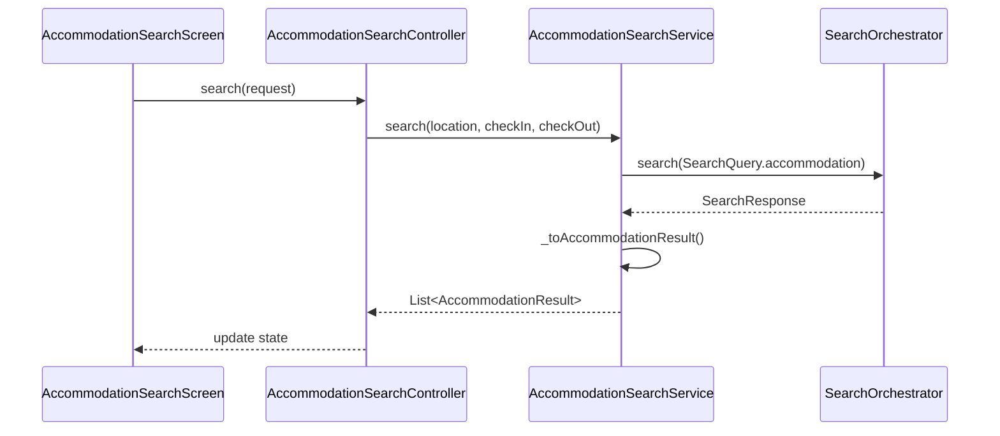

# Accommodation Feature

> Search and book hotels, hostels, and vacation rentals

## Overview

The Accommodation feature enables users to search for lodging options and save results to their active itinerary.

## Structure

```
accommodation/
├── presentation/          # UI Layer (4 files)
│   ├── accommodation_search_screen.dart
│   └── widgets/
├── application/           # Service Layer (8 files)
│   ├── accommodation_providers.dart
│   ├── accommodation_providers.g.dart
│   ├── accommodation_search_controller.dart
│   └── accommodation_prefill_service.dart
├── domain/                # Models (9 files)
│   ├── accommodation_models.dart
│   ├── accommodation_models.freezed.dart
│   └── accommodation_models.g.dart
└── data/                  # Repository Layer (5 files)
    ├── accommodation_repository.dart
    ├── accommodation_search_service.dart
    ├── mock_accommodation_repository.dart
    └── caching_accommodation_repository.dart
```

## Key Models

| Model | Purpose |
|-------|---------|
| `AccommodationResult` | Search result card (name, price, rating) |
| `AccommodationDetail` | Full property details with amenities |
| `AccommodationSearchRequest` | Search parameters (location, dates, guests) |
| `AccommodationType` | Hotel, Hostel, Apartment, Villa, etc. |

## Data Flow



## Search Platform Integration

The `AccommodationSearchService` is fully integrated with the unified Search Platform:

```dart
class AccommodationSearchService {
  final SearchOrchestrator _orchestrator;
  
  Future<List<AccommodationResult>> search({
    required String location,
    required DateTime checkIn,
    required DateTime checkOut,
    required int guests,
  }) async {
    final response = await _orchestrator.search(SearchQuery(
      vertical: SearchVertical.accommodation,
      params: {'location': location, 'checkIn': checkIn, 'checkOut': checkOut, 'guests': guests},
    ));
    return response.items.map(_toAccommodationResult).toList();
  }
}
```

## Features

- **Location-based Search**: Search by city or coordinates
- **Date Range Selection**: Check-in and check-out dates
- **Guest Configuration**: Rooms, adults, children
- **Amenity Filters**: Pool, WiFi, parking, etc.
- **Price Filtering**: Budget range selection
- **Star Rating Filter**: Minimum star rating
- **Save to Itinerary**: Automatic deduplication

## Providers

| Provider | Type | Purpose |
|----------|------|---------|
| `accommodationSearchServiceProvider` | `Provider` | Search service instance |
| `accommodationSearchControllerProvider` | `NotifierProvider` | UI state management |

## Routes

| Route | Screen |
|-------|--------|
| `/search/accommodation` | `AccommodationSearchScreen` |

## Dependencies

- `search_platform` - Unified search orchestration
- `core/application/save_item_service` - Saving to itinerary
- `core/data/drift_database` - Local caching
