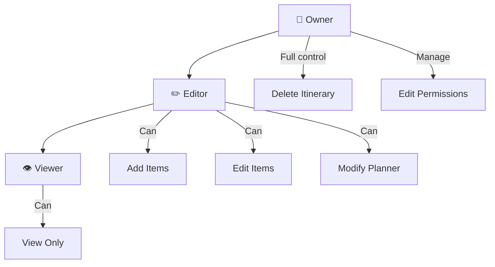

# Collaboration Feature

> Multi-user itinerary collaboration

## Overview

The Collaboration (Collab) feature enables users to share itineraries with others and collaborate on travel planning.

## Structure

```
collab/
├── presentation/          # UI Layer (3 files)
│   └── collab_settings_screen.dart
├── application/           # Service Layer (3 files)
│   ├── collab_service.dart
│   └── invite_service.dart
├── domain/                # Models (3 files)
│   ├── collab_models.dart
│   └── collab_models.freezed.dart
└── data/                  # Repository Layer (1 file)
    └── collab_repository.dart
```

## Permission Model



### Permission Levels

```dart
enum CollaboratorRole {
  owner,   // Full control, can delete
  editor,  // Can modify, add items
  viewer,  // Read-only access
}
```

## Key Models

### Collaborator

```dart
@freezed
abstract class Collaborator with _$Collaborator {
  const factory Collaborator({
    required String userId,
    required String email,
    required CollaboratorRole role,
    required DateTime addedAt,
    String? displayName,
    String? avatarUrl,
  }) = _Collaborator;
}
```

### CollabInvite

```dart
@freezed
abstract class CollabInvite with _$CollabInvite {
  const factory CollabInvite({
    required String id,
    required String itineraryId,
    required String inviterUserId,
    required CollaboratorRole role,
    required String token,
    required DateTime expiresAt,
    String? email,
    @Default(InviteStatus.pending) InviteStatus status,
  }) = _CollabInvite;
}

enum InviteStatus { pending, accepted, declined, expired }
```

## Components

### CollabService

Main collaboration service:

```dart
class CollabService {
  Future<List<Collaborator>> getCollaborators(String itineraryId);
  Future<void> addCollaborator(String itineraryId, String email, CollaboratorRole role);
  Future<void> removeCollaborator(String itineraryId, String userId);
  Future<void> updateRole(String itineraryId, String userId, CollaboratorRole role);
}
```

### InviteService

Invitation management:

```dart
class InviteService {
  Future<CollabInvite> createInvite(String itineraryId, CollaboratorRole role);
  Future<String> getInviteLink(CollabInvite invite);
  Future<void> acceptInvite(String token);
  Future<void> declineInvite(String token);
}
```

## Features

- **Invite via Email**: Send email invitations
- **Invite via Link**: Shareable invite links
- **Role Assignment**: Owner, Editor, Viewer
- **Permission Updates**: Change collaborator roles
- **Remove Collaborator**: Revoke access
- **Activity History**: See who made changes
- **Real-time Sync**: Live updates (when online)

## Access Control

```dart
// RBAC enforcement
class CollabRbacChecker {
  Future<bool> canView(String userId, String itineraryId);
  Future<bool> canEdit(String userId, String itineraryId);
  Future<bool> canManage(String userId, String itineraryId);
  Future<bool> canDelete(String userId, String itineraryId);
}
```

## Providers

| Provider | Type | Purpose |
|----------|------|---------|
| `collabServiceProvider` | `Provider` | Collaboration service |
| `inviteServiceProvider` | `Provider` | Invitation service |
| `collaboratorsProvider` | `FutureProvider` | List collaborators |

## Dependencies

- `itineraries` - Itinerary data
- `core/data/supabase` - Remote sync
- `search_api` - RBAC for saves
