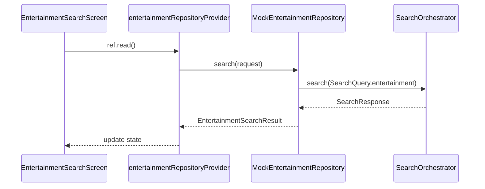

# Entertainment Feature

> Discover museums, landmarks, attractions, and activities

## Overview

The Entertainment feature enables users to search for things to do at their destination, including museums, landmarks, parks, theaters, and more.

## Structure

```
entertainment/
├── presentation/          # UI Layer (2 files)
│   └── entertainment_search_screen.dart
├── application/           # Service Layer (4 files)
│   ├── entertainment_providers.dart
│   ├── entertainment_providers.g.dart
│   └── entertainment_prefill_service.dart
├── domain/                # Models (3 files)
│   ├── entertainment_models.dart
│   ├── entertainment_models.freezed.dart
│   └── entertainment_models.g.dart
└── data/                  # Repository Layer (3 files)
    ├── entertainment_repository.dart
    ├── mock_entertainment_repository.dart
    └── caching_entertainment_repository.dart
```

## Key Models

| Model | Purpose |
|-------|---------|
| `EntertainmentResultCard` | Search result card |
| `EntertainmentPlaceDetail` | Full venue details |
| `EntertainmentTag` | Category enum (museum, garden, landmark, etc.) |
| `OpeningHours` | Weekly opening hours structure |

## Entertainment Tags

```dart
enum EntertainmentTag {
  museum,
  garden,
  landmark,
  architecture,
  viewpoint,
  park,
  historicSite,
  artGallery,
  theater,
  zoo,
  aquarium,
  themePark,
  beach,
  natureReserve,
  monument,
}
```

## Data Flow



## Features

- **Tag-based Filtering**: Filter by category (museums, parks, etc.)
- **Opening Hours**: Check if venues are currently open
- **Distance Sorting**: Sort by distance from location
- **Rating & Reviews**: Display user ratings
- **Photo Gallery**: Multiple venue photos
- **Save to Itinerary**: Automatic deduplication

## Providers

| Provider | Type | Purpose |
|----------|------|---------|
| `entertainmentRepositoryProvider` | `Provider` | Repository instance |
| `entertainmentPrefillServiceProvider` | `Provider` | Prefill service |

## Routes

| Route | Screen |
|-------|--------|
| `/search/entertainment` | `EntertainmentSearchScreen` |

## Dependencies

- `search_platform` - Unified search orchestration
- `core/application/save_item_service` - Saving to itinerary
- `core/data/drift_database` - Local caching
