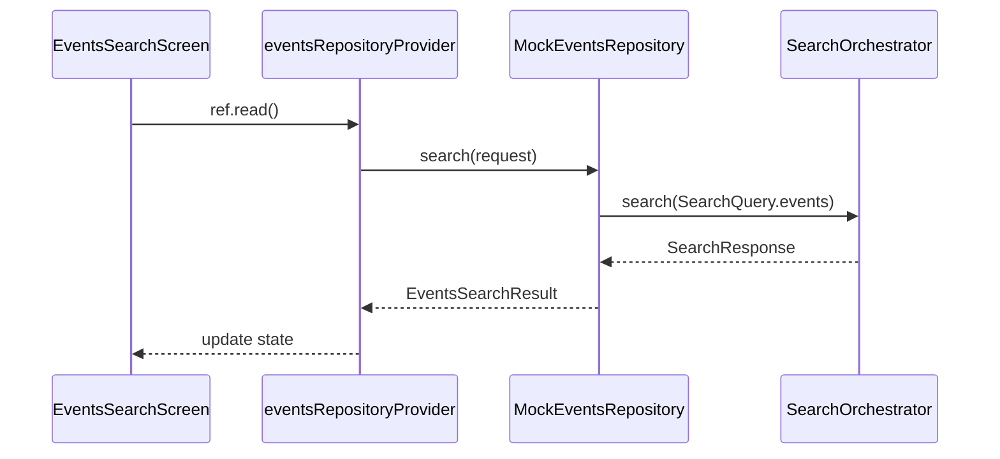

# Events Feature

> Discover concerts, festivals, sports, and local events

## Overview

The Events feature enables users to search for events and activities happening at their destination during their travel dates.

## Structure

```
events/
├── presentation/          # UI Layer (2 files)
│   └── events_search_screen.dart
├── application/           # Service Layer (5 files)
│   ├── events_providers.dart
│   ├── events_providers.g.dart
│   ├── events_prefill_service.dart
│   └── calendar_conflict_service.dart
├── domain/                # Models (6 files)
│   ├── events_models.dart
│   ├── events_models.freezed.dart
│   └── events_models.g.dart
└── data/                  # Repository Layer (3 files)
    ├── events_repository.dart
    ├── mock_events_repository.dart
    └── caching_events_repository.dart
```

## Key Models

| Model | Purpose |
|-------|---------|
| `EventCard` | Search result card |
| `EventDetail` | Full event details |
| `EventCategory` | Event type enum |
| `EventVenue` | Location information |
| `EventsFilters` | Filter parameters |
| `DateWindow` | Date range for search |

## Event Categories

```dart
enum EventCategory {
  concert,
  theatre,
  sports,
  festival,
  exhibition,
  conference,
}
```

## Data Flow



## Features

- **Date Window Search**: Find events within travel dates
- **Category Filtering**: Filter by event type
- **Family Friendly**: Filter for kid-friendly events
- **Free Events**: Filter for free entry events
- **Ticket Integration**: Direct links to buy tickets
- **Calendar Conflicts**: Detect scheduling conflicts
- **Save to Itinerary**: Automatic deduplication

## Providers

| Provider | Type | Purpose |
|----------|------|---------|
| `eventsRepositoryProvider` | `Provider` | Repository with caching |
| `eventsDatabaseProvider` | `Provider` | Database DAO |
| `calendarConflictServiceProvider` | `Provider` | Conflict detection |

## Routes

| Route | Screen |
|-------|--------|
| `/search/events` | `EventsSearchScreen` |

## Dependencies

- `search_platform` - Unified search orchestration
- `core/application/save_item_service` - Saving to itinerary
- `core/data/drift_database` - Local caching
