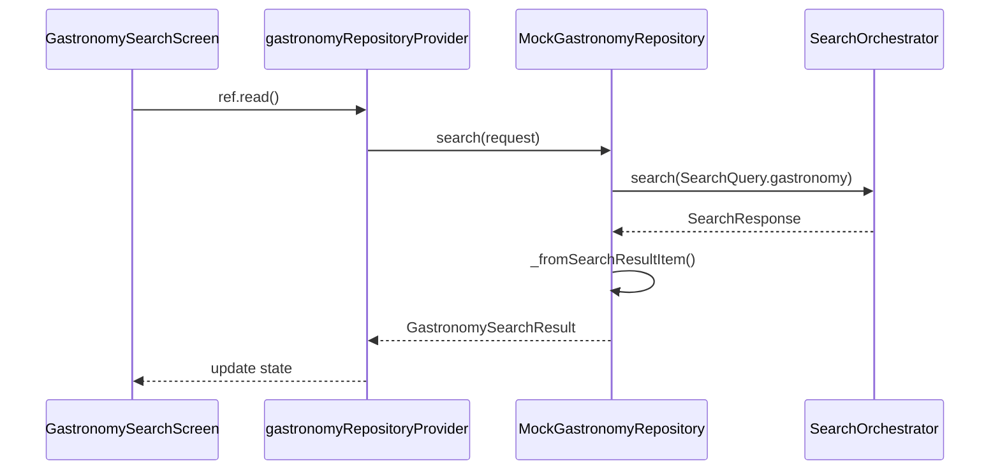

# Gastronomy Feature

> Discover restaurants, cafes, bars, and dining experiences

## Overview

The Gastronomy feature enables users to search for dining options with rich filtering by cuisine, dietary needs, price, and more.

## Structure

```
gastronomy/
├── presentation/          # UI Layer (2 files)
│   └── gastronomy_search_screen.dart
├── application/           # Service Layer (4 files)
│   ├── gastronomy_providers.dart
│   ├── gastronomy_providers.g.dart
│   └── gastronomy_prefill_service.dart
├── domain/                # Models (6 files)
│   ├── gastronomy_models.dart
│   ├── gastronomy_models.freezed.dart
│   └── gastronomy_models.g.dart
└── data/                  # Repository Layer (3 files)
    ├── gastronomy_repository.dart
    ├── mock_gastronomy_repository.dart
    └── caching_gastronomy_repository.dart
```

## Key Models

| Model | Purpose |
|-------|---------|
| `GastronomyResultCard` | Search result card |
| `GastronomyPlaceDetail` | Full restaurant details |
| `CuisineType` | Cuisine category enum |
| `DietaryOption` | Dietary restrictions enum |
| `PriceBand` | Price level (budget, moderate, upscale, fine) |
| `NoiseLevel` | Ambient noise level |

## Enums

### CuisineType
```dart
enum CuisineType {
  italian, french, japanese, chinese, indian,
  mexican, thai, mediterranean, american, cafe,
  seafood, steakhouse, vegetarian, fusion, local,
}
```

### DietaryOption
```dart
enum DietaryOption {
  vegetarian, vegan, glutenFree, halal,
  kosher, dairyFree, nutFree, organic,
}
```

### PriceBand
```dart
enum PriceBand { budget, moderate, upscale, fine }
```

## Data Flow



## Search Platform Integration

The `MockGastronomyRepository` is **fully integrated** with the unified Search Platform:

```dart
Future<GastronomySearchResult> search(GastronomySearchRequest request) async {
  if (_orchestrator != null) {
    final response = await _orchestrator.search(SearchQuery(
      vertical: SearchVertical.gastronomy,
      context: SearchContext(
        locale: 'en',
        currency: 'USD',
        userPrefs: SearchPrefs(
          dietaryFilters: request.filters?.dietary?.map((d) => d.name).toList() ?? [],
        ),
      ),
      params: {
        'location': request.place.value,
        'cuisines': request.filters?.cuisine?.map((c) => c.name).toList(),
        'priceBand': request.filters?.priceBand?.name,
        'openNow': request.filters?.openNow,
      },
    ));
    return _convertToResult(response);
  }
  // Fallback to local mock
}
```

## Features

- **Cuisine Filtering**: Filter by cuisine type
- **Dietary Filters**: Vegetarian, vegan, halal, etc.
- **Price Band**: Budget to fine dining
- **Open Now**: Filter for currently open venues
- **Kid/Dog Friendly**: Family and pet-friendly filters
- **Distance Sorting**: Sort by proximity
- **Save to Itinerary**: Automatic deduplication

## Providers

| Provider | Type | Purpose |
|----------|------|---------|
| `gastronomyRepositoryProvider` | `Provider` | Repository with caching |
| `gastronomyDatabaseProvider` | `Provider` | Database DAO |
| `gastronomyPrefillServiceProvider` | `Provider` | Prefill service |

## Routes

| Route | Screen |
|-------|--------|
| `/search/gastronomy` | `GastronomySearchScreen` |

## Dependencies

- `search_platform` - Unified search orchestration
- `core/application/save_item_service` - Saving to itinerary
- `core/data/drift_database` - Local caching
