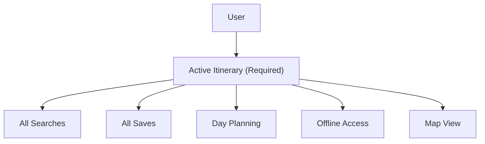
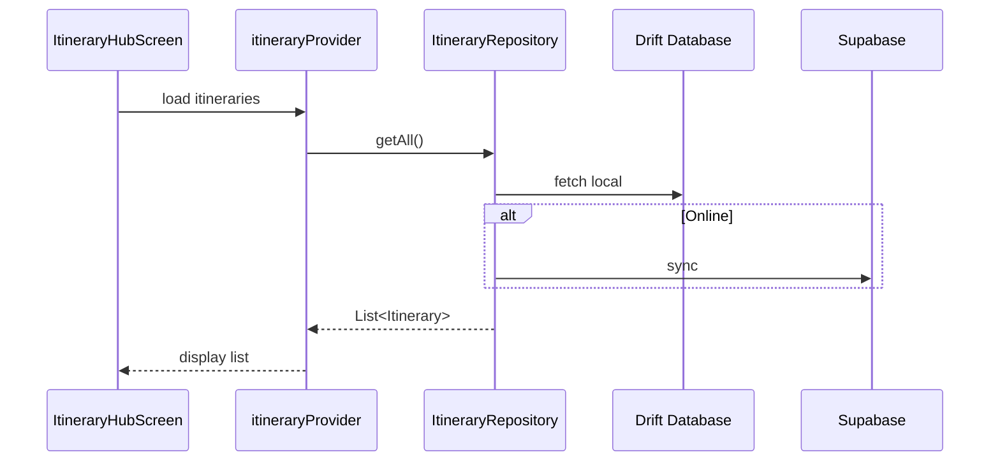

# Itineraries Feature

> Core feature for creating and managing travel itineraries

## Overview

The Itineraries feature is the central hub for managing travel plans. All other features (search, save, plan) operate within the context of an Active Itinerary.

## Structure

```
itineraries/
├── presentation/          # UI Layer (5 files)
│   ├── itinerary_hub_screen.dart
│   ├── create_itinerary_screen.dart
│   └── itinerary_overview_screen.dart
├── application/           # Service Layer (2 files)
│   ├── itinerary_providers.dart
│   └── itinerary_providers.g.dart
└── data/                  # Repository Layer (2 files)
    └── itinerary_repository.dart
```

## Key Concept: Active Itinerary



**Rule:** Users must always have an Active Itinerary. All operations are bound to this context.

## UI Screens

| Screen | Purpose |
|--------|---------|
| `ItineraryHubScreen` | List all itineraries, select active |
| `CreateItineraryScreen` | Create new or edit itinerary |
| `ItineraryOverviewScreen` | View sections, access planner/map |

## Key Models

The core `Itinerary` model lives in `core/domain/`:

```dart
@freezed
abstract class Itinerary with _$Itinerary {
  const factory Itinerary({
    required String id,
    required String title,
    required String destination,
    required DateTime startDate,
    required DateTime endDate,
    String? description,
    String? coverImageUrl,
    @Default([]) List<Collaborator> collaborators,
    required DateTime createdAt,
    required DateTime updatedAt,
  }) = _Itinerary;
}
```

## Data Flow



## Features

- **Create Itinerary**: Set destination, dates, title
- **Edit Itinerary**: Modify details
- **Delete Itinerary**: Remove with confirmation
- **Set Active**: Make itinerary the current context
- **View Sections**: See grouped saved items
- **Access Planner**: Navigate to day planning
- **Offline Download**: Prepare for offline use
- **Share/Collaborate**: Invite others

## Sections

Each itinerary has 6 sections mapped to search verticals:

```dart
enum ItinerarySection {
  transport,
  accommodation,
  entertainment,
  gastronomy,
  events,
  trails,
}
```

## Providers

| Provider | Type | Purpose |
|----------|------|---------|
| `itineraryRepositoryProvider` | `Provider` | Repository instance |
| `activeItineraryProvider` | `StateProvider` | Current active itinerary |
| `itineraryListProvider` | `FutureProvider` | All user itineraries |

## Routes

| Route | Screen |
|-------|--------|
| `/` | `ItineraryHubScreen` |
| `/create-itinerary` | `CreateItineraryScreen` |
| `/itinerary/:id` | `ItineraryOverviewScreen` |

## Dependencies

- `core/domain/itinerary` - Itinerary model
- `core/domain/saved_item` - SavedItem model
- `core/data/drift_database` - Local storage
- `planner` - Day planning feature
- `offline` - Offline package feature
- `collab` - Collaboration feature
