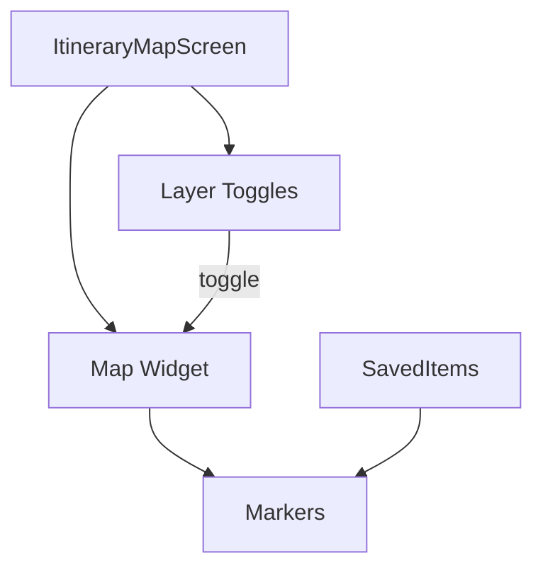

# Itinerary Map Feature

> Unified map view of all saved items in an itinerary

## Overview

The Itinerary Map feature provides a map-centric view of all saved items in the active itinerary, with layer toggles for each section.

## Structure

```
itinerary_map/
├── presentation/          # UI Layer (5 files)
│   ├── itinerary_map_screen.dart
│   └── widgets/
├── application/           # Service Layer (4 files)
│   ├── itinerary_map_providers.dart
│   └── itinerary_map_service.dart
└── domain/                # Models (2 files)
    └── map_models.dart
```

## Architecture



## Features

- **All Sections View**: See transport, accommodation, entertainment, etc. on one map
- **Layer Toggles**: Show/hide sections by type
- **Marker Clustering**: Group nearby items
- **Item Preview**: Tap marker for item details
- **Navigate to Item**: Link to full item details
- **Route Visualization**: Show travel routes (planner integration)
- **Current Location**: Show user's current position

## Layer System

```dart
enum MapLayer {
  transport,
  accommodation,
  entertainment,
  gastronomy,
  events,
  trails,
}

class MapLayerState {
  final Map<MapLayer, bool> visibility;
  
  void toggle(MapLayer layer);
  void showAll();
  void hideAll();
}
```

## Providers

| Provider | Type | Purpose |
|----------|------|---------|
| `itineraryMapServiceProvider` | `Provider` | Map data service |
| `mapLayerStateProvider` | `NotifierProvider` | Layer visibility |
| `mapMarkersProvider` | `FutureProvider` | Marker data |

## Routes

| Route | Screen |
|-------|--------|
| `/search/map` | `ItineraryMapScreen` |

## Dependencies

- `itineraries` - Active itinerary data
- `core/domain/saved_item` - Saved items
- `planner` - Route visualization
- `map` - Base map functionality
