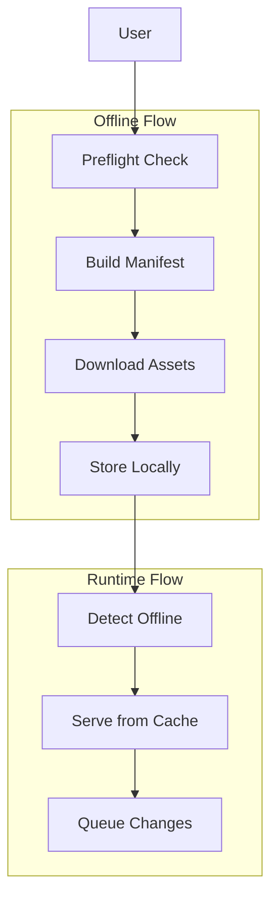

# Offline Feature

> Complete offline access for itineraries

## Overview

The Offline feature enables users to download itineraries for offline access, including all saved items, media, and map tiles.

## Structure

```
offline/
├── presentation/          # UI Layer (3 files)
│   └── offline_settings_screen.dart
├── application/           # Service Layer (7 files)
│   ├── offline_packager.dart
│   ├── offline_runtime.dart
│   ├── delta_update_service.dart
│   ├── share_flow_service.dart
│   └── preflight_service.dart
├── domain/                # Models (6 files)
│   ├── offline_manifest.dart
│   ├── offline_manifest.freezed.dart
│   ├── share_models.dart
│   └── share_models.freezed.dart
└── data/                  # Repository Layer (2 files)
    └── offline_repository.dart
```

## Architecture



## Key Models

### OfflineManifest

```dart
@freezed
abstract class OfflineManifest with _$OfflineManifest {
  const factory OfflineManifest({
    required String itineraryId,
    required int version,
    required DateTime createdAt,
    required List<OfflineAsset> assets,
    required OfflineMetadata metadata,
  }) = _OfflineManifest;
}
```

### OfflineAsset

```dart
@freezed
abstract class OfflineAsset with _$OfflineAsset {
  const factory OfflineAsset({
    required String id,
    required OfflineAssetType type,
    required String url,
    required int sizeBytes,
    String? checksum,
    @Default(false) bool downloaded,
  }) = _OfflineAsset;
}

enum OfflineAssetType {
  savedItem,
  media,
  mapTile,
  font,
}
```

### ShareBundle

```dart
@freezed
abstract class ShareBundle with _$ShareBundle {
  const factory ShareBundle({
    required String id,
    required String itineraryId,
    required DateTime createdAt,
    required int sizeBytes,
    required String downloadUrl,
  }) = _ShareBundle;
}
```

## Components

### OfflinePackager

Downloads and packages offline assets:

```dart
class OfflinePackager {
  Future<OfflineManifest> buildManifest(String itineraryId);
  Future<void> downloadAssets(OfflineManifest manifest, {
    void Function(double progress)? onProgress,
  });
  Future<bool> validatePackage(String itineraryId);
}
```

### OfflineRuntime

Serves content when offline:

```dart
class OfflineRuntime {
  Future<bool> isAvailableOffline(String itineraryId);
  Future<List<SavedItem>> getSavedItems(String itineraryId);
  void queueChange(OfflineChange change);
}
```

### DeltaUpdateService

Efficient incremental updates:

```dart
class DeltaUpdateService {
  Future<List<OfflineAsset>> computeDelta(
    OfflineManifest current,
    OfflineManifest updated,
  );
  Future<void> applyDelta(List<OfflineAsset> delta);
}
```

### ShareFlowService

Export/share offline packages:

```dart
class ShareFlowService {
  Future<ShareBundle> createBundle(String itineraryId);
  Future<void> exportToFile(ShareBundle bundle);
  Future<void> shareViaLink(ShareBundle bundle);
}
```

### PreflightService

Pre-download checks:

```dart
class PreflightService {
  Future<PreflightResult> check(String itineraryId);
  // Returns: total size, asset count, estimated time
}
```

## Features

- **Full Offline Access**: View all saved items offline
- **Media Caching**: Download images and photos
- **Map Tiles**: Offline map access
- **Delta Updates**: Efficient incremental sync
- **Export/Share**: Share offline packages
- **Progress Tracking**: Download progress UI
- **Space Management**: Clear offline cache

## Providers

| Provider | Type | Purpose |
|----------|------|---------|
| `offlinePackagerProvider` | `Provider` | Packaging service |
| `offlineRuntimeProvider` | `Provider` | Runtime service |
| `deltaUpdateServiceProvider` | `Provider` | Delta updates |
| `shareFlowServiceProvider` | `Provider` | Share flow |

## Dependencies

- `itineraries` - Itinerary data
- `core/domain/saved_item` - Saved items
- `core/data/drift_database` - Local storage
- `map` - Map tile caching
