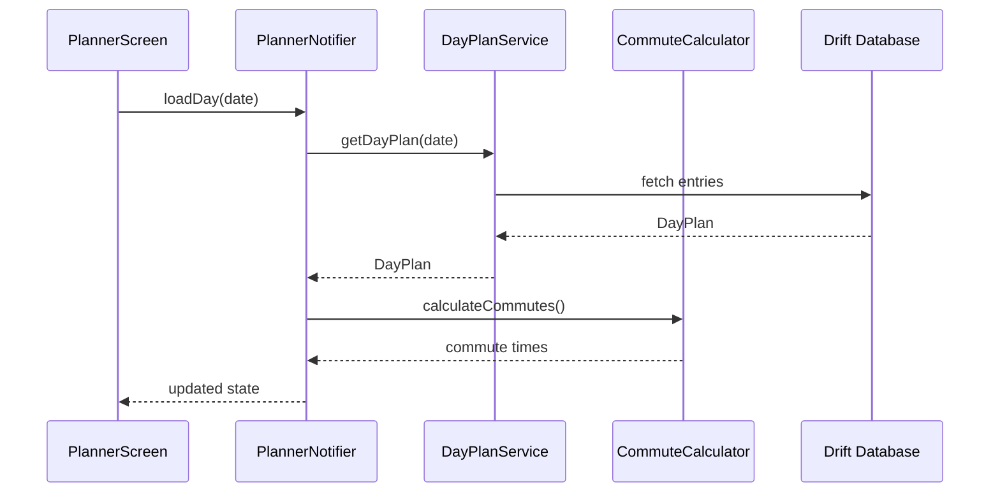

# Planner Feature

> Day-by-day schedule planning with commute calculations

## Overview

The Planner feature enables users to organize saved items into daily schedules with time slots, commute calculations, and conflict detection.

## Structure

```
planner/
├── presentation/          # UI Layer (7 files)
│   ├── planner_screen.dart
│   ├── day_timeline_widget.dart
│   └── entry_card_widget.dart
├── application/           # Service Layer (11 files)
│   ├── planner_providers.dart
│   ├── planner_providers.g.dart
│   ├── day_plan_service.dart
│   ├── auto_schedule_service.dart
│   ├── commute_calculator.dart
│   └── planner_notifier.dart
├── domain/                # Models (9 files)
│   ├── planner_models.dart
│   ├── planner_models.freezed.dart
│   └── planner_models.g.dart
└── data/                  # Repository Layer (1 file)
    └── planner_repository.dart
```

## Key Models

| Model | Purpose |
|-------|---------|
| `DayPlan` | Single day's schedule |
| `DayPlanEntry` | Individual activity in schedule |
| `PlanEntryType` | Fixed, flexible, or custom |
| `TravelMode` | Walk, transit, drive, none |

### DayPlan

```dart
@freezed
abstract class DayPlan with _$DayPlan {
  const factory DayPlan({
    required String itineraryId,
    required DateTime date,
    @Default([]) List<DayPlanEntry> entries,
    @Default(1) int version,
    DateTime? updatedAt,
  }) = _DayPlan;
}
```

### DayPlanEntry

```dart
@freezed
abstract class DayPlanEntry with _$DayPlanEntry {
  const factory DayPlanEntry({
    required String id,
    String? savedItemId,
    required String title,
    @Default(PlanEntryType.fixed) PlanEntryType type,
    DateTime? startTime,
    DateTime? endTime,
    @Default(60) int durationMinutes,
    @Default(TravelMode.none) TravelMode commuteMode,
    int? commuteDurationMinutes,
    int? bufferBeforeMinutes,
    String? notes,
  }) = _DayPlanEntry;
}
```

## Entry Types

```dart
enum PlanEntryType {
  fixed,   // Scheduled at specific time (flights, reservations)
  flex,    // Flexible timing (museums, walks)
  custom,  // User-created entries
}
```

## Travel Modes

```dart
enum TravelMode {
  walk,     // Walking
  transit,  // Public transportation
  drive,    // Car/taxi
  none,     // No commute needed
}
```

## Data Flow



## Features

- **Day Timeline View**: Visual timeline of activities
- **Fixed vs Flexible**: Distinguish scheduled vs anytime activities
- **Commute Calculation**: Auto-calculate travel time between entries
- **Auto-Schedule**: Automatically arrange flexible items
- **Conflict Detection**: Warn about overlapping activities
- **Drag-and-Drop**: Reorder entries
- **Buffer Time**: Add padding between activities
- **Notes**: Add custom notes to entries

## Services

| Service | Purpose |
|---------|---------|
| `DayPlanService` | CRUD for day plans |
| `AutoScheduleService` | Auto-arrange flexible items |
| `CommuteCalculator` | Calculate travel times |

## Providers

| Provider | Type | Purpose |
|----------|------|---------|
| `plannerNotifierProvider` | `NotifierProvider` | Planner state management |
| `dayPlanServiceProvider` | `Provider` | Day plan service |
| `commuteCalculatorProvider` | `Provider` | Commute calculations |

## Routes

| Route | Screen |
|-------|--------|
| `/itinerary/:id/planner` | `PlannerScreen` |

## Dependencies

- `itineraries` - Parent itinerary context
- `core/domain/saved_item` - Saved items to plan
- `core/data/drift_database` - Local storage
- `map` - For commute visualization
