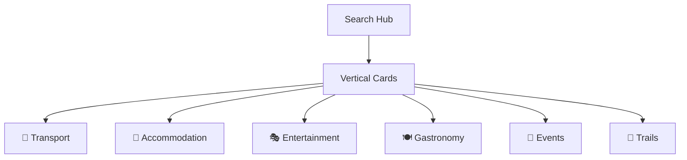

# Search Feature

> Search hub for vertical navigation

## Overview

The Search feature provides the main search hub that users navigate from to access specific search verticals.

## Structure

```
search/
└── presentation/          # UI Layer (1 file)
    └── search_screen.dart
```

## Purpose

This is a **navigation-focused** feature that:
- Displays the main search hub UI
- Provides quick access to all 6 search verticals
- Shows recent/suggested searches
- Manages search context

## UI Elements



## Routes

| Route | Screen |
|-------|--------|
| `/search` | `SearchScreen` |

## Navigation Targets

| Card | Route |
|------|-------|
| Transport | `/search/transport` |
| Accommodation | `/search/accommodation` |
| Entertainment | `/search/entertainment` |
| Gastronomy | `/search/gastronomy` |
| Events | `/search/events` |
| Trails | `/search/trails` |

## Dependencies

- All 6 search vertical features
