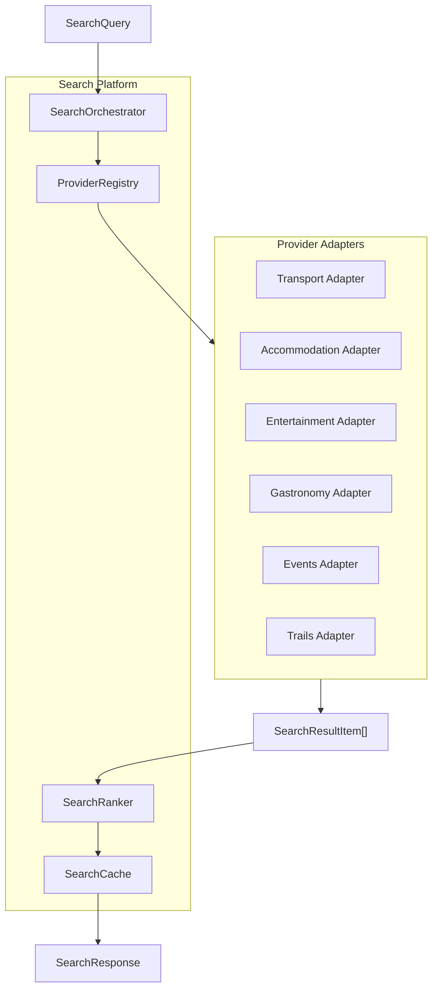

# Search Platform Feature

> Unified search orchestration across all verticals

## Overview

The Search Platform provides a centralized search infrastructure that orchestrates queries across all 6 search verticals (transport, accommodation, entertainment, gastronomy, events, trails).

## Structure

```
search_platform/
├── application/           # Service Layer (3 files)
│   ├── search_orchestrator.dart
│   ├── search_orchestrator.g.dart
│   └── search_telemetry.dart
├── domain/                # Models (3 files)
│   ├── search_models.dart
│   ├── search_models.freezed.dart
│   └── search_models.g.dart
└── data/                  # Provider Layer (2 files)
    ├── provider_adapter.dart
    └── provider_registry.dart
```

## Architecture



## Key Models

### SearchVertical

```dart
enum SearchVertical {
  transport,
  accommodation,
  entertainment,
  gastronomy,
  events,
  trails,
}
```

### SearchQuery

```dart
@freezed
abstract class SearchQuery with _$SearchQuery {
  const factory SearchQuery({
    required SearchVertical vertical,
    required SearchContext context,
    required Map<String, dynamic> params,
    @Default(0) int page,
    @Default(20) int pageSize,
    String? cursor,
    @Default(SearchFlags()) SearchFlags flags,
  }) = _SearchQuery;
}
```

### SearchResultItem (Canonical Format)

```dart
@freezed
abstract class SearchResultItem with _$SearchResultItem {
  const factory SearchResultItem({
    required String id,
    required String dedupeKey,
    required SearchVertical vertical,
    required String title,
    String? subtitle,
    String? imageUrl,
    double? price,
    String? priceCurrency,
    double? rating,
    int? reviewCount,
    double? latitude,
    double? longitude,
    Map<String, dynamic>? details,
    @Default([]) List<String> provenance,
    Map<String, dynamic>? rankingExplain,
  }) = _SearchResultItem;
}
```

## Components

### SearchOrchestrator

Central coordinator that:
- Routes queries to appropriate adapters
- Aggregates results from multiple providers
- Applies ranking and caching
- Handles provider failures gracefully

```dart
class SearchOrchestrator {
  final ProviderRegistry registry;
  final SearchCache cache;
  final SearchRanker ranker;
  
  Future<SearchResponse> search(SearchQuery query) async {
    // 1. Check cache
    // 2. Get adapter for vertical
    // 3. Execute search
    // 4. Rank results
    // 5. Cache response
    // 6. Return results
  }
}
```

### ProviderRegistry

Manages provider adapters per vertical:

```dart
class ProviderRegistry {
  final Map<SearchVertical, List<ProviderAdapter>> _adapters = {};
  
  void register(ProviderAdapter adapter);
  List<ProviderAdapter> getAdapters(SearchVertical vertical);
}
```

### ProviderAdapter

Interface for vertical-specific providers:

```dart
abstract class ProviderAdapter {
  ProviderConfig get config;
  Future<SearchResponse> search(SearchQuery query);
}
```

### SearchCache

Multi-level caching:

```dart
class SearchCache {
  // Cache key = hash(vertical|params|locale|currency|page)
  Future<SearchResponse?> get(SearchQuery query);
  Future<void> set(SearchQuery query, SearchResponse response);
}
```

### SearchRanker

Applies ranking strategies:

```dart
enum RankingStrategy {
  relevance,
  priceLowToHigh,
  priceHighToLow,
  rating,
  distance,
  duration,
  popularity,
}

class SearchRanker {
  List<SearchResultItem> rank(
    List<SearchResultItem> items,
    RankingStrategy strategy,
    Map<String, double> weights,
  );
}
```

## Telemetry

`SearchTelemetry` tracks:
- Request latency per provider
- Cache hit/miss ratios
- Error rates
- Result counts

## Providers

| Provider | Type | Purpose |
|----------|------|---------|
| `searchOrchestratorProvider` | `Provider` | Main orchestrator |
| `providerRegistryProvider` | `Provider` | Adapter registry |
| `searchCacheProvider` | `Provider` | Result cache |
| `searchRankerProvider` | `Provider` | Ranking service |

## Integration

All search services integrate via `SearchOrchestrator`:

```dart
// In TransportSearchService
final response = await _orchestrator.search(SearchQuery(
  vertical: SearchVertical.transport,
  context: SearchContext(locale: 'en', currency: 'USD'),
  params: {'origin': 'NYC', 'destination': 'LAX'},
));
```

## Dependencies

- `core/data/drift_database` - Local caching
- All 6 search vertical features - As consumers
