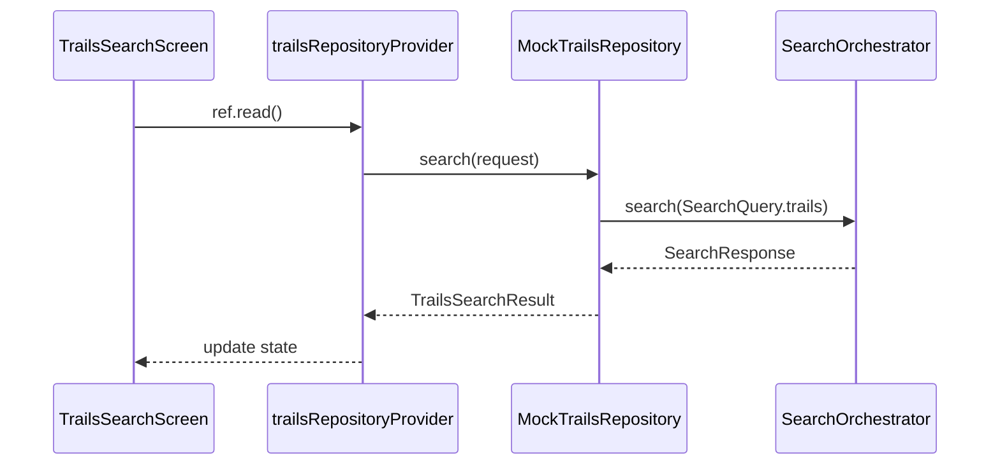

# Trails Feature

> Discover hiking trails, walking routes, and nature paths

## Overview

The Trails feature enables users to search for outdoor trails with filtering by difficulty, distance, elevation, and more.

## Structure

```
trails/
├── presentation/          # UI Layer (2 files)
│   └── trails_search_screen.dart
├── application/           # Service Layer (5 files)
│   ├── trails_providers.dart
│   ├── trails_providers.g.dart
│   └── trails_prefill_service.dart
├── domain/                # Models (6 files)
│   ├── trails_models.dart
│   ├── trails_models.freezed.dart
│   └── trails_models.g.dart
└── data/                  # Repository Layer (3 files)
    ├── trails_repository.dart
    ├── mock_trails_repository.dart
    └── caching_trails_repository.dart
```

## Key Models

| Model | Purpose |
|-------|---------|
| `TrailCard` | Search result card |
| `TrailDetail` | Full trail details |
| `TrailDifficulty` | Difficulty level enum |
| `TrailLocation` | Trailhead location |

## Trail Difficulty

```dart
enum TrailDifficulty {
  easy,
  moderate,
  hard,
}
```

## Data Flow



## Features

- **Difficulty Filtering**: Easy, moderate, hard
- **Distance Range**: Filter by trail length
- **Elevation Gain**: Filter by elevation
- **Duration Estimate**: Estimated hiking time
- **Loop Detection**: Identify loop vs out-and-back trails
- **Photo Gallery**: Trail photos
- **Save to Itinerary**: Automatic deduplication

## Providers

| Provider | Type | Purpose |
|----------|------|---------|
| `trailsRepositoryProvider` | `Provider` | Repository with caching |
| `trailsDatabaseProvider` | `Provider` | Database DAO |
| `trailsPrefillServiceProvider` | `Provider` | Prefill service |

## Routes

| Route | Screen |
|-------|--------|
| `/search/trails` | `TrailsSearchScreen` |

## Dependencies

- `search_platform` - Unified search orchestration
- `core/application/save_item_service` - Saving to itinerary
- `core/data/drift_database` - Local caching
