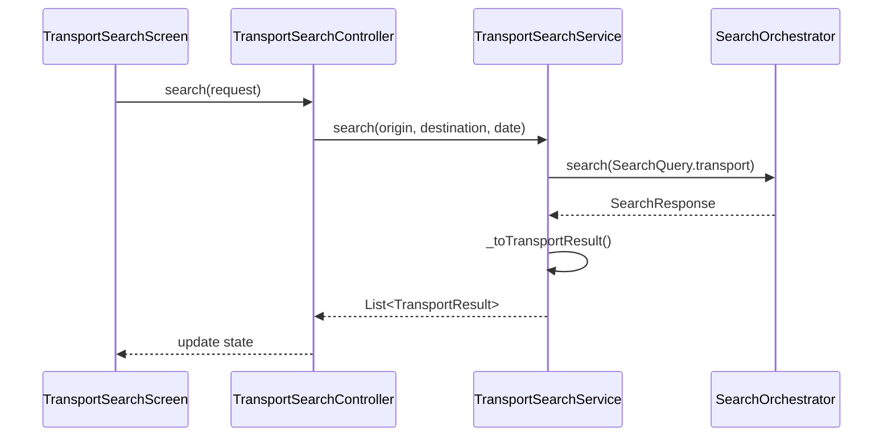

# Transport Feature

> Search and book transportation (flights, trains, buses)

## Overview

The Transport feature enables users to search for transportation options between destinations and save results to their active itinerary.

## Structure

```
transport/
├── presentation/          # UI Layer (5 files)
│   ├── transport_search_screen.dart
│   └── widgets/
├── application/           # Service Layer (4 files)
│   ├── transport_providers.dart
│   ├── transport_providers.g.dart
│   ├── transport_search_controller.dart
│   └── transport_prefill_service.dart
├── domain/                # Models (9 files)
│   ├── transport_models.dart
│   ├── transport_models.freezed.dart
│   └── transport_models.g.dart
└── data/                  # Repository Layer (5 files)
    ├── transport_repository.dart
    ├── transport_search_service.dart
    ├── mock_transport_repository.dart
    └── caching_transport_repository.dart
```

## Key Models

| Model | Purpose |
|-------|---------|
| `TransportResult` | Search result card (route, price, duration) |
| `TransportOffer` | Detailed offer with segments |
| `TransportSearchRequest` | Search parameters (origin, destination, dates) |
| `TransportSegment` | Individual leg of journey |

## Data Flow



## Search Platform Integration

The `TransportSearchService` is fully integrated with the unified Search Platform:

```dart
class TransportSearchService {
  final SearchOrchestrator _orchestrator;
  
  Future<List<TransportResult>> search({
    required String origin,
    required String destination,
    required DateTime date,
  }) async {
    final response = await _orchestrator.search(SearchQuery(
      vertical: SearchVertical.transport,
      params: {'origin': origin, 'destination': destination, 'date': date},
    ));
    return response.items.map(_toTransportResult).toList();
  }
}
```

## Features

- **One-way & Multi-city Search**: Search between multiple destinations
- **Meet-up Mode**: Find optimal meeting points
- **Price Calendar**: View prices across date range
- **Filter & Sort**: By price, duration, stops
- **Save to Itinerary**: Automatic deduplication

## Providers

| Provider | Type | Purpose |
|----------|------|---------|
| `transportSearchServiceProvider` | `Provider` | Search service instance |
| `transportSearchControllerProvider` | `NotifierProvider` | UI state management |

## Routes

| Route | Screen |
|-------|--------|
| `/search/transport` | `TransportSearchScreen` |

## Dependencies

- `search_platform` - Unified search orchestration
- `core/application/save_item_service` - Saving to itinerary
- `core/data/drift_database` - Local caching
